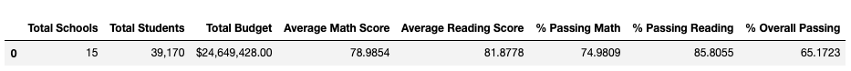
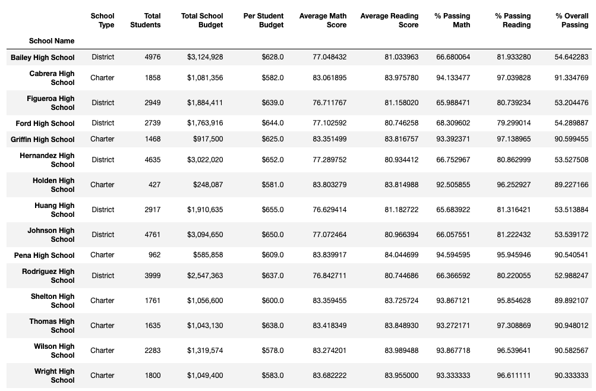
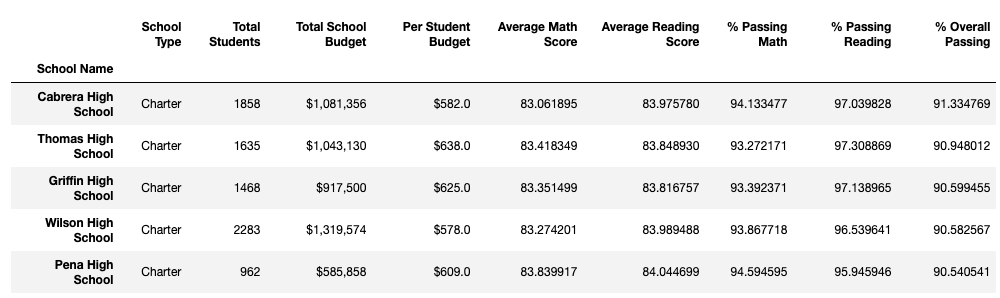
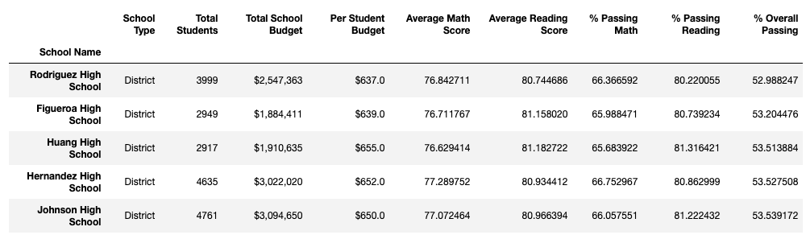
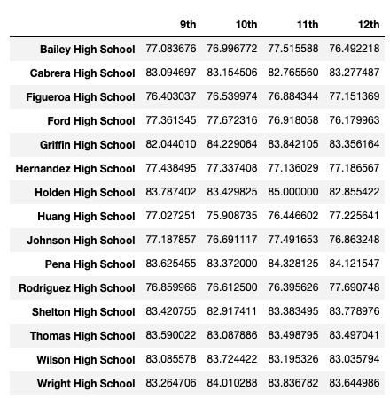
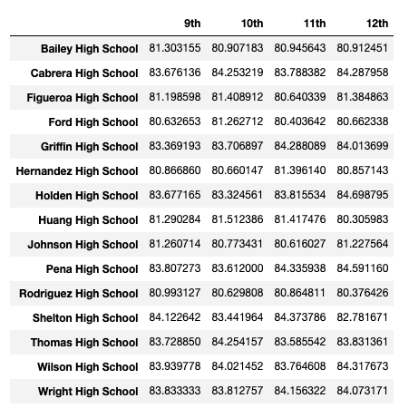
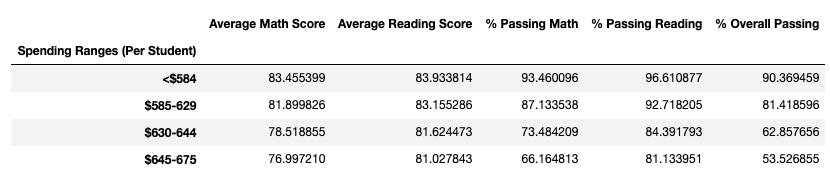
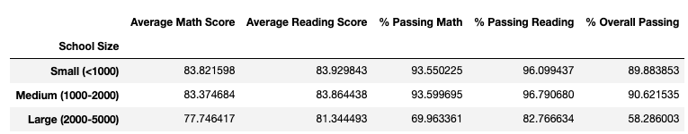
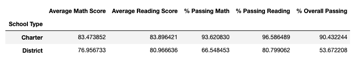

# Pandas, Pandas, Pandas

Applying Python Pandas into analysis via Jupyter Notebook.

## PyCity School

### Background

Assuming that I have become the *Chief Data Scientist* for my city's school district. The request is to help the school board and mayor make strategic decisions regarding future school budgets and priorities. 

The raw data given are every student's math and reading scores, as well as various information on the schools they attend. The final report will include each of the following:

* District Summary
* School Summary
* Top 5 Performing Schools (By % Overall Passing)
* Bottom 5 Performing Schools (By % Overall Passing)
* Scores by Grade (9th to 12th)
    * Math scores
    * Reading scores
* Scores by different categories
    * School Spending
    * School Size
    * School Type
* Analysis

**City School Data file** >> [Click here](Resources/city_school_data_complete.csv)

---

## Final Report

**To view calculation method** >> [Click here](https://nbviewer.jupyter.org/github/abpuccini/pandas-challenge/blob/master/PyCitySchools/PyCitySchool.ipynb)

**To download final report (excel file)** >> [Click here](https://github.com/abpuccini/pandas-challenge/raw/master/PyCitySchools/city_school_final_report.xlsx) 

### District Summary

---

### School Summary

---

### Top 5 Performing Schools (By % Overall Passing)

---

### Bottom 5 Performing Schools (By % Overall Passing)

---

### Scores by Grade (9th to 12th)

* **Math scores**

---

* **Reding scores**

---

### Scores by Different Categories

* **School Spending**

---

* **School Size**

---

* **School Type**

---

### Analysis

Based on the City School data, statistic data and tables, the analysis will be presented as following:

Refer to the Scores by **School Spending** table, schools that spend on their budget on each student **less** seem to have **better performance** than schools that spend more money on each student.

Refer to the Scores by **School Size**, there is a significant difference of school's performance between schools that have less than 2,000 students and more than 2,000 students. The **bigger size** schools tend to have **lower performance**.

Refer to the Scores by **School Type**, **Charter** school tend to has **better performance** than District school.

---

© Atcharaporn B Puccini